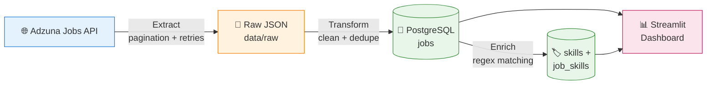
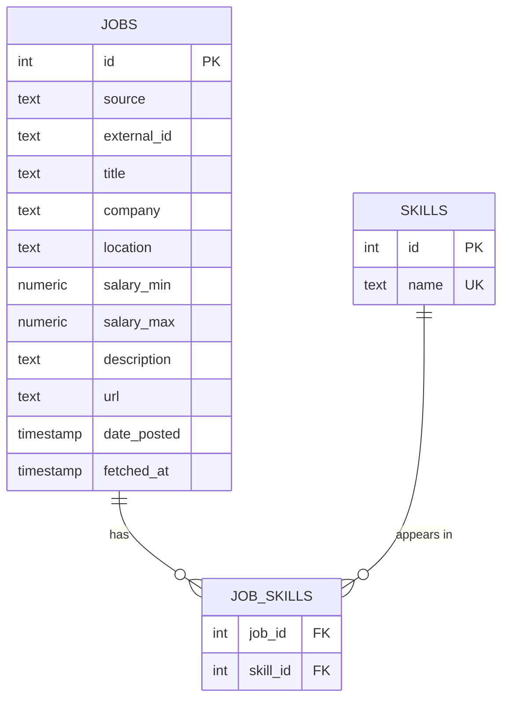

<div align="center">

# 🔎 Job Match Assistant

### Turning thousands of real job postings into clear career insights

**An end-to-end data engineering pipeline that collects live job listings, cleans and stores them in PostgreSQL, discovers the most in-demand technical skills, and visualizes the job market in an interactive dashboard.**


</div>

---

## 💡 Why I Built This

As a student preparing for data, cloud, and AI roles, I kept asking one question:

> **"Which skills do employers actually want right now?"**

Online advice was inconsistent, and reading hundreds of job postings by hand wasn't realistic. So I built a system that answers the question with **real data**. It collects live job postings automatically, analyzes them, and shows exactly which skills are in demand.

---

## ✨ Key Features

| | Feature | Description |
|---|---|---|
| 📥 | **Automated data collection** | Pulls job postings for 5 roles from the Adzuna Jobs API with pagination and automatic retries |
| 🧹 | **Data cleaning** | Removes HTML, standardizes fields, validates salaries, and eliminates duplicate postings |
| 🗄️ | **Relational database** | Stores clean data in a normalized PostgreSQL schema running in Docker |
| 🔁 | **Safe to re-run** | Idempotent upserts mean running the pipeline twice never creates duplicates |
| 🏷️ | **Skill extraction** | Scans every posting for 34 technical skills using carefully designed regex patterns |
| 📊 | **Interactive dashboard** | Streamlit app showing top skills, locations, companies, trends, and salaries |
| ⏰ | **Scheduling ready** | GitHub Actions workflow included for daily automated runs |
| 💸 | **100% free stack** | Every tool used is free or open source |

---

## 📊 Results from the First Run

<div align="center">

| 📥 Postings Fetched | ✅ Unique Jobs | 🗑️ Duplicates Removed | 🏷️ Skills Tracked | 🌐 API Requests |
|:---:|:---:|:---:|:---:|:---:|
| **750** | **711** | **39** | **34** | **15** |

</div>

### 🏆 Top 10 Most-Demanded Skills

| Rank | Skill | Postings | Demand |
|:---:|---|:---:|---|
| 🥇 | Machine Learning | 171 | ██████████████████ |
| 🥈 | AWS | 97 | ██████████ |
| 🥉 | LLM | 84 | █████████ |
| 4 | Python | 62 | ██████ |
| 5 | SQL | 49 | █████ |
| 6 | Azure | 45 | █████ |
| 7 | ETL | 28 | ███ |
| 8 | Snowflake | 27 | ███ |
| 9 | Databricks | 26 | ███ |
| 10 | GCP | 22 | ██ |

> 💬 **Insight:** Machine learning and cloud skills (AWS, Azure, GCP) dominate current demand, and **LLM experience already ranks #3**, ahead of Python and SQL.

<!-- 📸 Add your dashboard screenshot: save it as docs/dashboard.png and remove these comment marks -->
<!--  -->

---

## 🏗️ System Architecture



The pipeline follows the classic **ETL (Extract → Transform → Load)** pattern and uses a layered data design:

| Layer | Where | What it holds |
|---|---|---|
| 🥉 **Bronze** (raw) | `data/raw/*.json` | Untouched API responses, saved daily |
| 🥈 **Silver** (clean) | `jobs` table | Cleaned, deduplicated job postings |
| 🥇 **Gold** (insights) | `skills`, `job_skills` + dashboard | Skill tags and aggregated metrics |

---

## ⚙️ How It Works

### 1️⃣ Extract: collecting job postings
**File:** `ingestion/fetch_jobs.py`

- Searches **5 roles**: data engineer, data analyst, cloud engineer, machine learning engineer, and AI engineer
- Fetches up to **3 pages × 50 results** per role, limited to postings from the **last 7 days**
- Uses **exponential backoff** (waits 2s → 4s → 8s) when the API is busy (`429`) or has server errors (`5xx`)
- **Fails fast** on permanent errors like an invalid key (`401`), since retrying wouldn't help
- Uses a **30-second timeout** so the script never hangs
- Pauses between requests to respect the API
- Saves raw responses to a **dated JSON file**, so data can be reprocessed without new API calls

### 2️⃣ Transform & Load: cleaning and storing
**File:** `transform/clean_load.py`

| Step | What happens |
|---|---|
| 🔓 Flatten | Pulls nested fields (like `company.display_name`) into flat columns |
| 🧽 Clean text | Strips HTML tags with BeautifulSoup and collapses extra whitespace |
| 📅 Parse dates | Converts date strings to real timestamps; invalid dates become empty |
| 💰 Validate salaries | Converts to numbers and removes unrealistic values (under $1,000) |
| 🗑️ Deduplicate | Removes the same job found by multiple searches *and* jobs reposted under new IDs |
| 📤 Upsert | Batch-inserts with `ON CONFLICT DO UPDATE`: new jobs are added, existing ones updated |

All inserts run inside a **transaction**, so a failure midway never leaves half-loaded data.

### 3️⃣ Enrich: finding skills
**File:** `transform/extract_skills.py`

Each posting is scanned for **34 skills** across 7 categories:

| Category | Skills |
|---|---|
| 💻 Languages | Python, SQL, Java, Scala, JavaScript |
| ☁️ Cloud | AWS, Azure, GCP |
| 🔧 Data Engineering | Spark, Kafka, Airflow, dbt, Snowflake, Databricks, ETL |
| 🗄️ Databases | PostgreSQL, MongoDB |
| 🚀 DevOps | Docker, Kubernetes, Terraform, CI/CD, Git, Linux |
| 📈 Analytics | Tableau, Power BI, Excel, Pandas |
| 🤖 AI / ML | Machine Learning, Deep Learning, NLP, LLM, PyTorch, TensorFlow, scikit-learn |

The regex patterns handle tricky cases:

| Challenge | Solution |
|---|---|
| "SQL" shouldn't match inside "NoSQL" | Word boundaries: `\bsql\b` |
| "Java" shouldn't match "JavaScript" | Negative lookahead: `\bjava\b(?!\s*script)` |
| "Spark" and "PySpark" are the same skill | Optional prefix: `\b(py)?spark\b` |
| "AWS" is also written "Amazon Web Services" | Alternatives: `\baws\b\|amazon web services` |

### 4️⃣ Visualize: the dashboard
**File:** `app/dashboard.py`

| Section | Shows |
|---|---|
| 📌 Key metrics | Total postings, number of companies, average salary |
| 🏷️ Top skills | Bar chart of the 20 most-demanded skills |
| 📍 Top locations | Where the most jobs are |
| 🏢 Top companies | Who is hiring the most |
| 📈 Trends | Postings over time |
| 💰 Salary by skill | Median salary for each skill |

---

## 🗄️ Database Design



**Why it's designed this way:**

- 🔑 **`UNIQUE (source, external_id)`** identifies each job by its source and ID, preventing duplicates and enabling upserts.
- 🔗 **`job_skills` junction table** models the many-to-many relationship: one job has many skills, and one skill appears in many jobs.
- 🧹 **`ON DELETE CASCADE`** removes a job's skill links automatically when the job is deleted.
- ⚡ **Index on `date_posted`** keeps time-based queries fast.
- 🧠 **pgvector installed** so AI embeddings can be added in Phase 2 without changing the database.

---

## 🧰 Tech Stack

| Category | Tools |
|---|---|
| **Language** | Python 3.11+ |
| **Data processing** | pandas, BeautifulSoup, regex |
| **Database** | PostgreSQL 16, pgvector, psycopg2 |
| **Infrastructure** | Docker |
| **Visualization** | Streamlit |
| **Automation** | GitHub Actions |
| **Data source** | Adzuna Jobs API |
| **Configuration** | python-dotenv |

---

## 📁 Project Structure

```
job-match-assistant/
├── 📂 ingestion/
│   └── fetch_jobs.py          # Extract: API calls, pagination, retries
├── 📂 transform/
│   ├── clean_load.py          # Transform + Load into PostgreSQL
│   └── extract_skills.py      # Skill tagging
├── 📂 app/
│   └── dashboard.py           # Streamlit dashboard
├── 📂 ai/                     # Phase 2: resume matching
├── 📂 infra/                  # Phase 3: deployment
├── 📂 .github/workflows/
│   └── daily_pipeline.yml     # Scheduled daily runs
├── 📄 db.py                   # Shared database connection
├── 📄 run_pipeline.py         # Runs the whole pipeline
├── 📄 schema.sql              # Database tables
├── 📄 requirements.txt        # Python dependencies
└── 📄 .env.example            # Environment variable template
```

---

## 🚀 Getting Started

### Prerequisites
- 🐍 [Python 3.11+](https://www.python.org/downloads/)
- 🐳 [Docker Desktop](https://www.docker.com/products/docker-desktop/)
- 🔑 A free [Adzuna developer account](https://developer.adzuna.com)

### Installation

**1. Clone the repository**
```bash
git clone https://github.com/rajryadav4/job-match-assistant.git
cd job-match-assistant
```

**2. Set up a virtual environment**
```bash
python3 -m venv venv
source venv/bin/activate        # Windows: venv\Scripts\activate
pip install -r requirements.txt
```

**3. Add your settings**
```bash
cp .env.example .env            # then add your Adzuna ID and key
```

**4. Start the database**
```bash
docker run --name jobs-db -e POSTGRES_PASSWORD=change_me -e POSTGRES_DB=jobs \
  -p 5432:5432 -v jobs-data:/var/lib/postgresql/data -d pgvector/pgvector:pg16

docker exec -i jobs-db psql -U postgres -d jobs < schema.sql
```

**5. Run the pipeline**
```bash
python run_pipeline.py
```

**6. Launch the dashboard**
```bash
streamlit run app/dashboard.py
```
Then open **http://localhost:8501** 🎉

---

## 🧠 Engineering Decisions

| Decision | Why |
|---|---|
| ✅ **Official API instead of scraping** | Scraping LinkedIn or Indeed violates their terms and breaks when pages change |
| ✅ **Save raw data before cleaning** | Bugs can be fixed and data reprocessed without new API calls |
| ✅ **Upserts instead of delete-and-reload** | Safe to re-run, preserves history, supports incremental updates |
| ✅ **Batch inserts** | One database call instead of hundreds is much faster |
| ✅ **Docker for PostgreSQL** | One-command setup that is reproducible and easy to reset |
| ✅ **Secrets in `.env`** | API keys never reach GitHub |
| ✅ **Regex skill extraction** | Fast, free, predictable, and easy to explain; ML-based extraction is a planned upgrade |

---

## ⚠️ Known Limitations

- 📝 **Short descriptions:** Adzuna provides description snippets, so some skills are missed. Adding a full-description source is the next improvement.
- 🔤 **Keyword matching:** regex can't understand context (for example, "no Java required" still counts as Java).
- 🔁 **Repost detection** currently works within one batch only.
- 💰 **Salary data** is available for only some postings.

---

## 🛣️ Roadmap

### ✅ Phase 1: Data Pipeline *(complete)*
- [x] API ingestion with pagination and retries
- [x] Data cleaning and deduplication
- [x] Normalized PostgreSQL database
- [x] Skill extraction (34 skills)
- [x] Interactive Streamlit dashboard

### 🔜 Phase 1 Improvements
- [ ] Enable daily automation with a free cloud database
- [ ] Add the Remotive API for full job descriptions
- [ ] Process only new files (incremental loading)
- [ ] Unit tests with pytest

### 🤖 Phase 2: AI Resume Matching
- [ ] Upload a resume (PDF)
- [ ] Match jobs using embeddings (sentence-transformers + pgvector)
- [ ] Show a match score for each job (e.g. "87% match")
- [ ] Identify missing skills for each job
- [ ] Suggest tailored resume bullets with a local LLM (Ollama)

### ☁️ Phase 3: Deployment
- [ ] Public dashboard on Streamlit Community Cloud
- [ ] Full Docker Compose setup
- [ ] Infrastructure as code (OpenTofu)

---

## 🎯 What I Learned

- Designing **ETL pipelines** that are reliable, repeatable, and safe to re-run
- Working with **REST APIs**, including pagination, rate limits, and error handling
- **Database design**: normalization, constraints, indexes, and many-to-many relationships
- **Data cleaning** with pandas for messy, real-world data
- Running services in **Docker** and managing configuration securely
- Building **dashboards** that turn data into insights

---

<div align="center">

## 👤 Author

**Raj Yadav**
*Student | Data Engineering • Cloud • AI*

[](https://github.com/rajryadav4)

⭐ **If you found this project interesting, consider giving it a star!** ⭐

</div>
